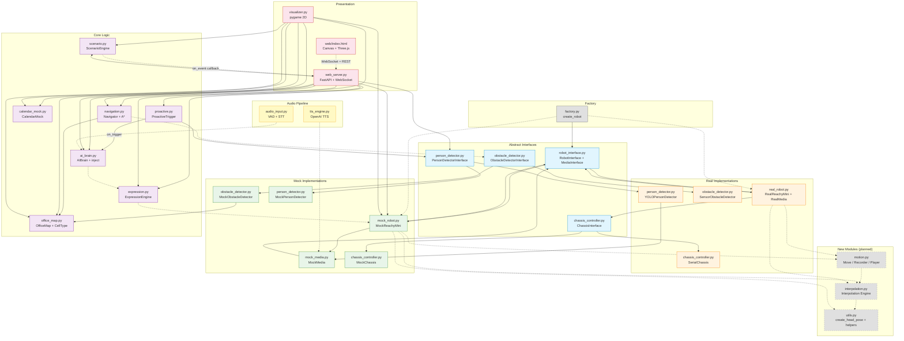
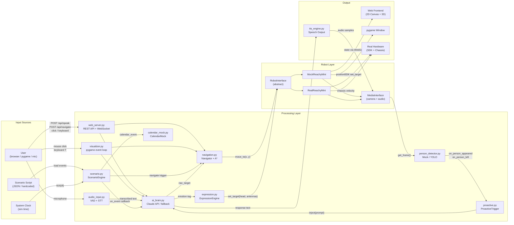

# Reachy Mini Simulator - Architecture

## 1. Module Dependency Graph

## 2. Data Flow Diagram

## 3. Interface Extension Reference

### 3.1 RobotInterface

| Method | Category | Existing | New | Description |
|--------|----------|:--------:|:---:|-------------|
| `set_target(head, antennas, body_yaw)` | Control | V | | Set target pose (instant) |
| `goto_target(head, antennas, body_yaw, duration, method)` | Control | | V | Interpolated motion over duration |
| `get_current_joint_positions() -> dict[str, float]` | Query | | V | All joint angles as flat dict |
| `move_to(x, y)` | Navigation | V | | Set chassis move target |
| `update_position(dt) -> bool` | Navigation | V | | Tick chassis movement |
| `is_moving -> bool` | Navigation | V | | Chassis in motion? |
| `position / heading` | Navigation | V | | 2D pose on map |
| `media -> MediaInterface` | Accessor | V | | Camera + audio access |
| `antenna_pos -> list[float]` | Query | V | | Current antenna angles (rad) |
| `head_pose -> ndarray(4,4)` | Query | V | | Current head pose matrix |
| `body_yaw -> float` | Query | V | | Current body yaw (rad) |
| `get_state_summary() -> dict` | Query | V | | Full state snapshot |
| `look_at_image(u, v)` | Gaze | | V | Point head at image pixel |
| `look_at_world(x, y, z)` | Gaze | | V | Point head at world coordinate |
| `wake_up() / goto_sleep()` | Lifecycle | | V | Power state transitions |
| `is_awake -> bool` | Lifecycle | | V | Power state query |
| `set_motor_enabled(motor, enabled)` | Motor | | V | Enable/disable individual motor |
| `is_motor_enabled(motor) -> bool` | Motor | | V | Query motor state |
| `set_gravity_compensation(enabled)` | Motor | | V | Toggle gravity compensation |
| `get_imu_data() -> dict` | Sensor | | V | Accelerometer + gyroscope data |
| `start_motion_recording()` | Motion | | V | Begin recording joint trajectory |
| `stop_motion_recording() -> Move` | Motion | | V | End recording, return Move object |
| `play_motion(move, speed)` | Motion | | V | Play back a recorded motion |
| `is_motion_playing -> bool` | Motion | | V | Is motion playback active? |
| `close()` | Lifecycle | V | | Release all resources |

### 3.2 MediaInterface

| Method | Category | Existing | New | Description |
|--------|----------|:--------:|:---:|-------------|
| `get_frame() -> ndarray` | Camera | V | | Capture one BGR frame |
| `get_output_audio_samplerate() -> int` | Audio | V | | Output sample rate (Hz) |
| `start_playing() / stop_playing()` | Audio | V | | Audio playback control |
| `push_audio_sample(samples)` | Audio | V | | Push samples to playback buffer |
| `is_playing -> bool` | Audio | V | | Playback active? |
| `play_sound(file_path)` | Sound | | V | Play a sound file (wav/mp3) |
| `is_sound_playing() -> bool` | Sound | | V | Sound file playback active? |
| `stop_sound()` | Sound | | V | Stop sound file playback |
| `start_recording() / stop_recording()` | Recording | | V | Microphone recording control |
| `get_audio_sample() -> ndarray` | Recording | | V | Get recorded audio buffer |
| `is_recording -> bool` | Recording | | V | Recording active? |
| `get_doa() -> float` | Spatial | | V | Direction of arrival (rad) |
| `close()` | Lifecycle | V | | Release resources |

### 3.3 PersonDetectorInterface (person_detector.py)

Person detection abstraction with Mock and YOLO implementations.

| Method / Property | Category | Description |
|-------------------|----------|-------------|
| `start()` | Lifecycle | Start detection |
| `stop()` | Lifecycle | Stop detection |
| `is_running -> bool` | Lifecycle | Running state |
| `person_visible -> bool` | Query | At least one person visible? |
| `person_count -> int` | Query | Number of detected persons |
| `person_positions -> list[tuple]` | Query | Normalized (0~1) positions |
| `get_person_absence_duration() -> float` | Query | Seconds since last person seen |
| `update(dt)` | Tick | Per-frame update (sim loop) |

**MockPersonDetector** adds `inject_person(name, pos)`, `remove_person(name)`, `get_persons()`.

**YOLOPersonDetector** requires `MediaInterface` for frames, runs YOLO in background thread.

### 3.4 ProactiveTrigger (proactive.py)

Monitors person events and idle state to proactively initiate conversation.

| Method / Property | Category | Description |
|-------------------|----------|-------------|
| `start() / stop()` | Lifecycle | Trigger lifecycle |
| `is_running -> bool` | Lifecycle | Running state |
| `enabled` | Config | Enable/disable toggle |
| `greet_cooldown -> float` | Config | Greet cooldown (seconds) |
| `idle_timeout -> float` | Config | Idle trigger timeout (seconds) |
| `reset_idle_timer()` | Control | Reset idle timer on user interaction |
| `update(dt)` | Tick | Per-frame idle check |
| `on_trigger` | Callback | `callback(trigger_type, prompt_text)` |

Trigger types: `greet`, `farewell`, `idle`.

### 3.5 New Module: interpolation.py

Smooth trajectory interpolation engine for joint movements.

| Class / Function | Description |
|------------------|-------------|
| `InterpolationMethod` | Enum: LINEAR, MINIMUM_JERK, CUBIC |
| `interpolate(start, end, t, method)` | Compute interpolated value at time t in [0,1] |
| `JointTrajectory` | Manages a multi-joint interpolation over duration |

### 3.6 New Module: motion.py

Motion recording and playback system.

| Class / Function | Description |
|------------------|-------------|
| `Move` | Dataclass holding recorded joint trajectory + metadata |
| `MotionRecorder` | Records joint positions at fixed interval into Move |
| `MotionPlayer` | Plays back a Move with speed control |
| `Move.save(path)` / `Move.load(path)` | Serialize / deserialize to JSON |

### 3.7 New Module: utils.py

Shared utility functions.

| Function | Description |
|----------|-------------|
| `create_head_pose(yaw, pitch, roll, degrees) -> ndarray(4,4)` | Build head pose matrix (extracted from expression.py) |
| `pose_to_euler(pose) -> (yaw, pitch, roll)` | Extract Euler angles from 4x4 matrix |
| `clamp(value, min_val, max_val)` | Numeric clamp helper |

## 4. Implementation Phases

| Phase | Scope | Key Modules | Owner |
|-------|-------|-------------|-------|
| **1A** | Interpolation + goto_target + get_joint_positions + utils | interpolation.py, utils.py, robot_interface.py, mock_robot.py | api-engineer |
| **1B** | Gaze control (look_at_image, look_at_world) | robot_interface.py, mock_robot.py | api-engineer |
| **1C** | Lifecycle (wake/sleep, motor enable, gravity comp) | robot_interface.py, mock_robot.py | api-engineer |
| **2A** | Sound file playback (play_sound, stop_sound) | robot_interface.py, mock_media.py | api-engineer |
| **2B** | Microphone recording + DOA | robot_interface.py, mock_media.py | api-engineer |
| **2C** | IMU data | robot_interface.py, mock_robot.py | api-engineer |
| **3** | Motion recording/playback | motion.py, robot_interface.py, mock_robot.py | api-engineer |
| **4A** | REST API + WebSocket extension | web_server.py | fullstack |
| **4B** | Frontend UI panels | web/index.html | fullstack |
| **4C** | Simulation loop integration | web_server.py, visualizer.py | fullstack |
| **4D** | Expression engine upgrade | expression.py | fullstack |
| **5A** | PersonDetectorInterface + Mock + YOLO | person_detector.py | api-engineer |
| **5B** | ProactiveTrigger + AIBrain.inject | proactive.py, ai_brain.py | api-engineer |
| **5C** | Perception Web API + WebSocket + Frontend | web_server.py, web/index.html | fullstack |
| **5D** | QA: unit + integration + regression + web tests | tests/ | qa |
